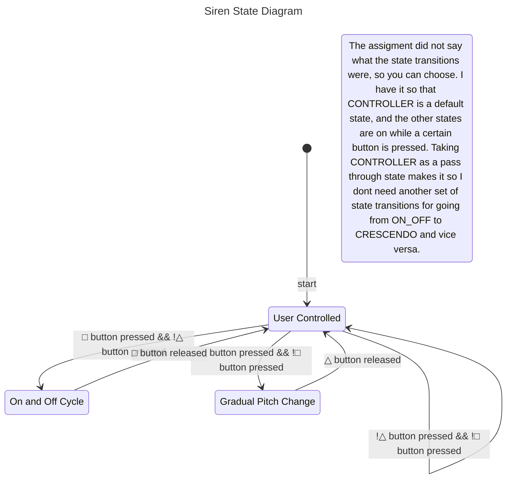

```mermaid

---
title: Siren State Diagram
---
stateDiagram-v2
state "User Controlled" as CONTROLLER
state "On and Off Cycle" as ON_OFF
state "Gradual Pitch Change" as CRESCENDO

[*] --> CONTROLLER: start

note: The assigment did not say what the state transitions were, so you can choose. I have it so that CONTROLLER is a default state, and the other states are on while a certain button is pressed. Taking CONTROLLER as a pass through state makes it so I dont need another set of state transitions for going from ON_OFF to CRESCENDO and vice versa.

# It is good practice to have state transitions be completely unambiguous: If two outward state transition conditions are both true, then it matters in which order they were implemented in the code, which we don't want as then not all state behavior is shown in the diagram.
CONTROLLER --> ON_OFF: □ button pressed && !△ button pressed
CONTROLLER --> CRESCENDO: △ button pressed && !□ button pressed

# This is up to personal preference, but I prefer using the get___ButtonPressed() and get___ButtonReleased() methods rather than the get___Button() method, as it makes it easier to follow your state logic.
ON_OFF --> CONTROLLER: □ button released
CRESCENDO --> CONTROLLER: △ button released

# for clarity, you can have state transitions marked in your diagram for when you want to stay in a state. However, we sometimes skip this because usually you stay in the state if all other conditions fail, so circular state transitions are implied.
CONTROLLER --> CONTROLLER: !△ button pressed && !□ button pressed

```